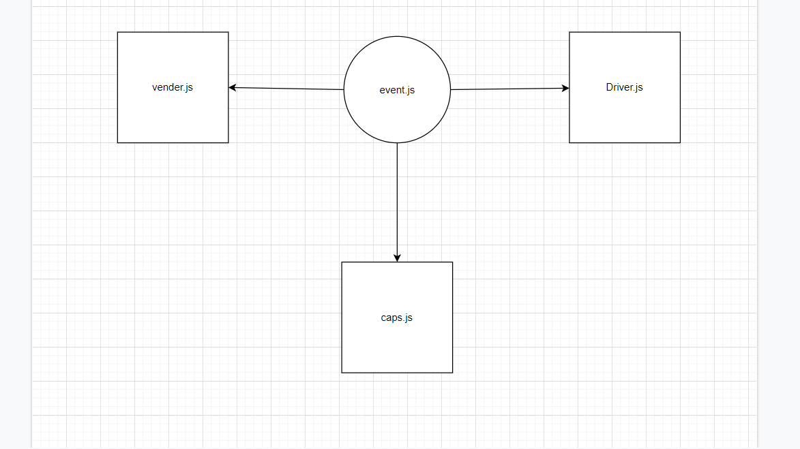

# caps

## how to work with this repo:
#### npm init -y
#### npm i faker dotenv
#### npm i -D jest
# [PR](https://github.com/zaidalasfar97/caps/pull/1)
# [Action](https://github.com/zaidalasfar97/caps/actions)

## Uml :

## I do this lap with Baha zghayar and afnan damra 